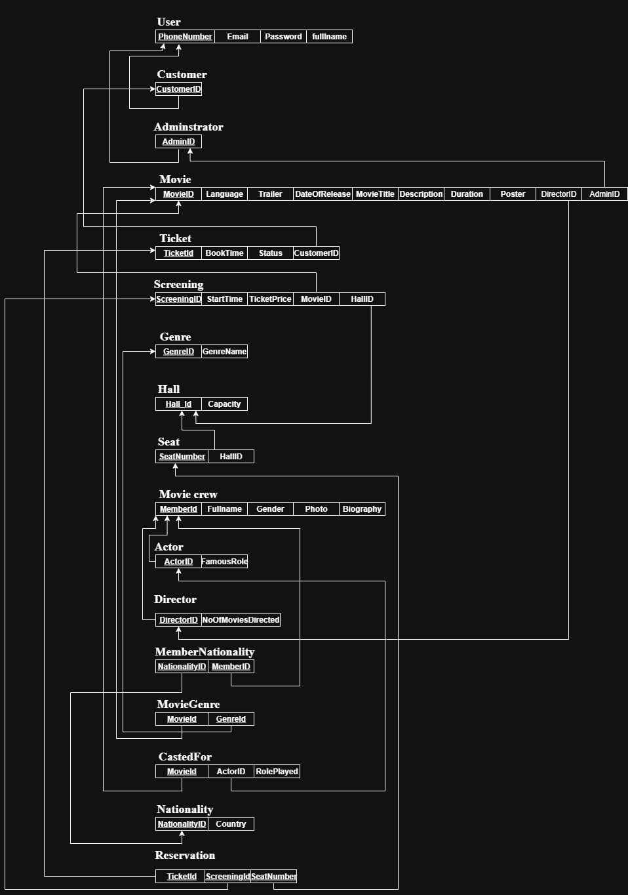
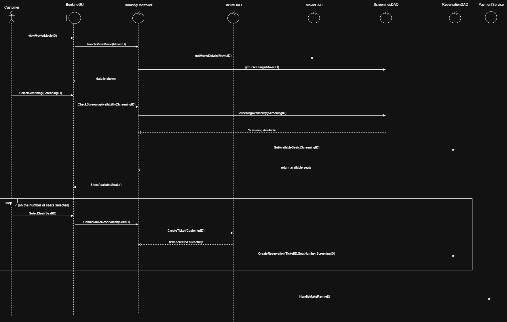
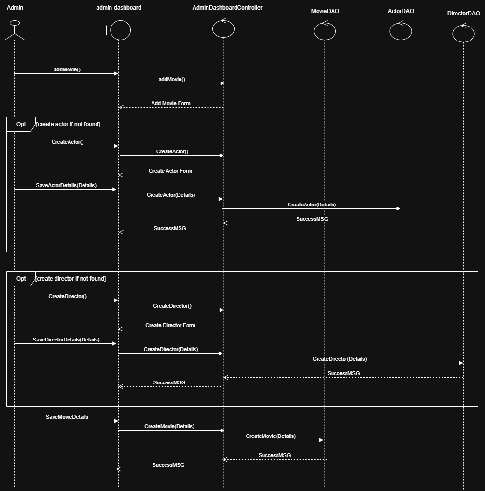

---

## 👤 User Accounts
For demo purposes, two users are preloaded in the database:

- **Admin:**  
  - Email: `bob@example.com`  
  - Password: `bob`  

- **Customer:**  
  - Email: `alice@example.com`  
  - Password: `alice`  

These accounts allow you to explore both the administrative dashboard and the customer-facing movie browser.

---

## 🖼️ Screenshots

### 🔑 Login Page

### 🎬 Movie Browser (Customer View)

### 📄 Movie Details

### 🎟️ Ticket Reservation
  

### 🛠️ Admin Dashboard
  
  
  

---

## 📊 Sequence & Design Diagrams
The following diagrams provide insight into system design and flow:

- **Schema Diagram:**   
- **Use Case Diagram:**   
- **Booking Sequence:**   
- **Add Movie Sequence:** 

---

## 📚 Course Context
This project was developed as part of a **Database Systems course**.  
- Primary focus: **Database schema design**, **SQL integration**, and **Hibernate ORM** mapping.  
- Secondary focus: building a functional JavaFX UI to interact with the database.  
- Timeframe: **1 week**, under a tight deadline.  

---

## ⚙️ Tech Stack
- **Frontend/UI:** JavaFX  
- **Backend:** Java 17, Hibernate ORM  
- **Database:** Microsoft SQL Server  
- **Build Tool:** Maven  
- **Authentication:** BCrypt password hashing  

---

## 🙏 Acknowledgments
This project was completed under significant time constraints and is intended for **educational purposes** only.  
Special thanks to the course instructors for guidance in database design.
