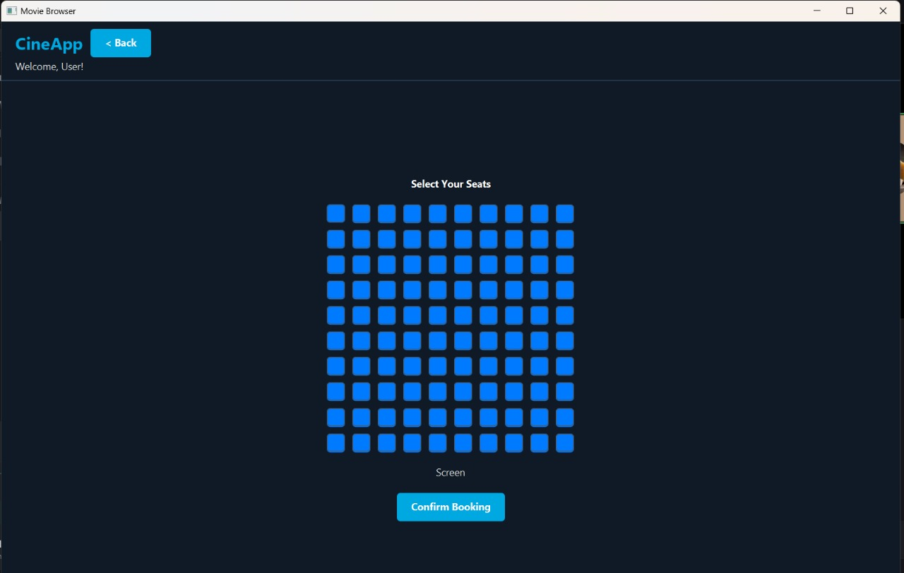

# 🎟️ Cinema Ticket Booking System
A Java-based cinema ticket booking application using JavaFX, Maven, Hibernate, and SQL Server.

---

## 🗄 Database Design
  
*For the full schema and additional diagrams, see the [docs](docs/) folder.*

---

## 🚀 How to Run
### 1️⃣ Clone the Repository

Recommended (IntelliJ IDEA)
1. Open IntelliJ IDEA → New Project from Version Control.
2. Paste the repo URL:
  `https://github.com/tarek-moh/Cinema-Ticket-booking-System`
3. Click Clone.
4. When prompted, select Load Maven Project.

Alternative (Command Line)
`git clone https://github.com/tarek-moh/Cinema-Ticket-booking-System`

### 2️⃣ Set Up SQL Server
1. Install Microsoft SQL Server and SQL Server Management Studio (SSMS).
2. Create a local SQL Server instance.
   - Enable both Windows Authentication and SQL Server Authentication.
   - Create a username/password for the instance.

### 3️⃣ Create the Database
Run the provided database script:
`cinemaDB.sql`
(This file contains the schema and seed data.)

### 4️⃣ Configure Hibernate Connection
1. Open:
  `src/main/resources/hibernate.cfg.xml`
2. Update the `<property name="hibernate.connection.url">` line:
  `jdbc:sqlserver://localhost;databaseName=<DBname>;user=<Username>;password=<Password>;trustServerCertificate=true`
  
### ✅ You’re ready to run the project!
Use IntelliJ’s Run button or:
  `mvn clean install
   mvn exec:java`
---

## 👤 User Accounts
For demo purposes, two users are preloaded in the database:

- **Admin:**  
  - Email: `bob@example.com`  
  - Password: `bob`  

- **Customer:**  
  - Email: `alice@example.com`  
  - Password: `alice`  

These accounts allow you to explore both the administrative dashboard and the customer-facing movie browser.

---

## 🖼️ Screenshots

### 🔑 Login Page

### 🎬 Movie Browser (Customer View)

### 📄 Movie Details

### 🎟️ Ticket Reservation
  

### 🛠️ Admin Dashboard
  
  
  

---

## 📊 Sequence & Design Diagrams
The following diagrams provide insight into system design and flow:

- **Use Case Diagram:**   
- Rest of Diagrams are in Docs folder.

---

## 📚 Course Context
This project was developed as part of a **Database Systems course**.  
- Primary focus: **Database schema design**, **SQL integration**, and **Hibernate ORM** mapping.  
- Secondary focus: building a functional JavaFX UI to interact with the database.  
- Timeframe: **1 week**, under a tight deadline.  

---

## ⚙️ Tech Stack
- **Frontend/UI:** JavaFX  
- **Backend:** Java 17, Hibernate ORM  
- **Database:** Microsoft SQL Server  
- **Build Tool:** Maven  
- **Authentication:** BCrypt password hashing  

---

## 🙏 Acknowledgments
This project was completed under significant time constraints and is intended for **educational purposes** only.  
Special thanks to the course instructors for guidance in database design.
